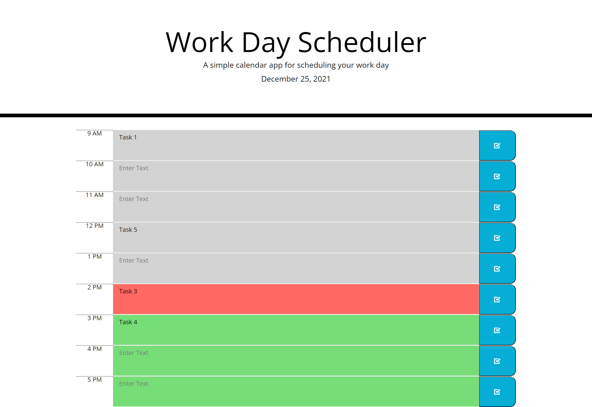
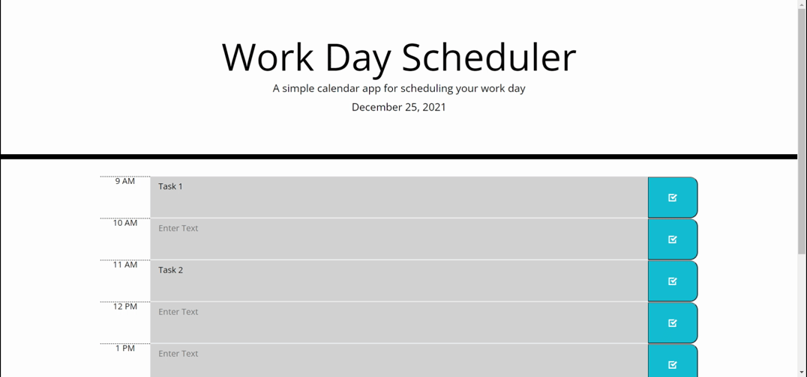

# Work Day Scheduler

Work Day Schechuler is a web app which stores daily tasks and presents them on the web page, organized by the hour in which they occur

## Website

https://chris-backes.github.io/work-day-scheduler/

## Screenshot



## Gif

<p align="center">

</p>

## User Story
```
AS AN employee with a busy schedule
I WANT to add important events to a daily planner
SO THAT I can manage my time effectively
```

## Acceptance Criteria
```
GIVEN I am using a daily planner to create a schedule
WHEN I open the planner
THEN the current day is displayed at the top of the calendar
WHEN I scroll down
THEN I am presented with time blocks for standard business hours
WHEN I view the time blocks for that day
THEN each time block is color-coded to indicate whether it is in the past, present, or future
WHEN I click into a time block
THEN I can enter an event
WHEN I click the save button for that time block
THEN the text for that event is saved in local storage
WHEN I refresh the page
THEN the saved events persist
```

## Description

The web app is dynamically created from JavaScript, with some help from JQuery and, in the case of the time features, moment.js. It is styled with bootstrap, a font library, and two icon libraries (as well as a native style sheet).

The tasks can be written in a center textarea element of the HTML, and on the right there is a save button, which calls a JQuery function that stores the content in local storage.

The HTML body contains an onload attribute, which calls the loadTasks function, pulling the content from local storage and displaying it on the web page.

There is another script which executes during the course of dynmically creating the content, which styles the hours according to the hours that have passed, the present hour, and the future hours of the day.